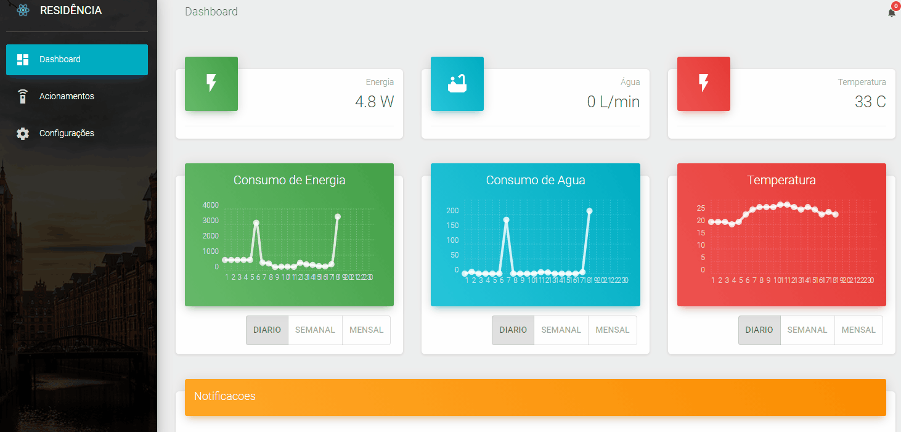
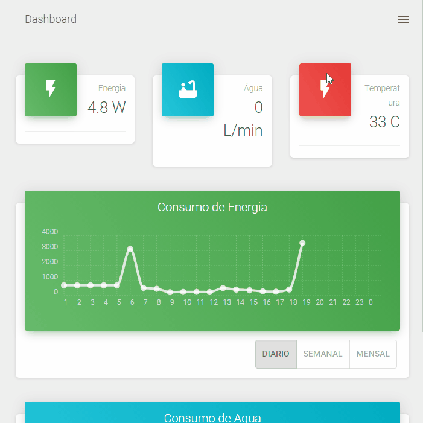
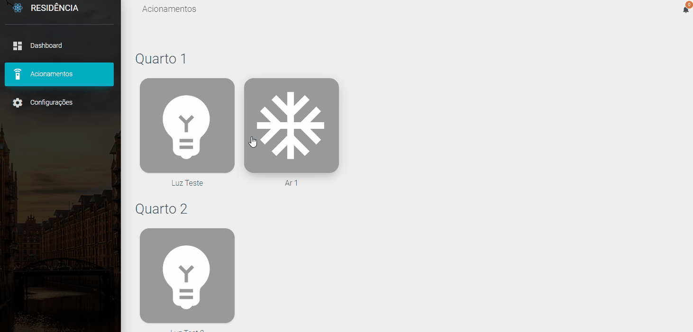
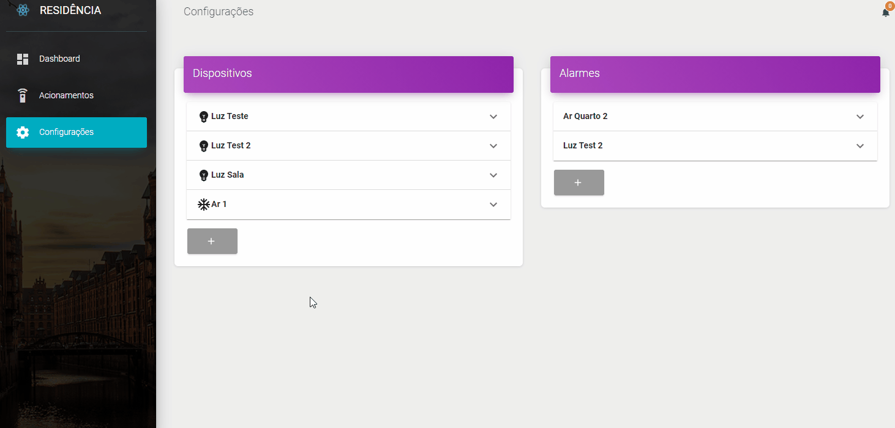
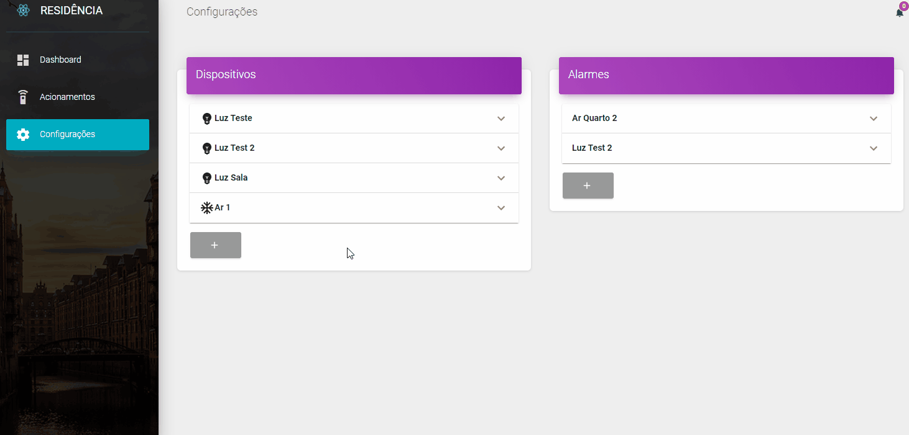

# [HomeBoard (using material dashboard)](https://demos.creative-tim.com/material-dashboard-react/#/dashboard) 

 

## Introduction
 This is HomeBoard, a brand new Dashboard with Home Automation Features including:
 * Real-time sensor data visualization.
 * Historic view of data from sensors.
 * Turning on/off devices from home via buttons or automated routines.
 * Browser and mobile compatibility!

 It uses MQTT protocol to communicate with a wi-fi microcontroller, and updates values in realtime on a MongoDB database using 

 ## Showoff

 Here are the views of some features in HomeBoard:
* Mobile screen view with drawer menu:

* Turning on/off devices from home:

* Device menu:

* Adding new devices and alarms:

* Database entries:

## Todo
* Upgrade historic views to be more responsive and cleaner.
* Add slider control for devices that can assume multiple values (not only toggle).
* Bug fixes to month/week/daily views on charts.