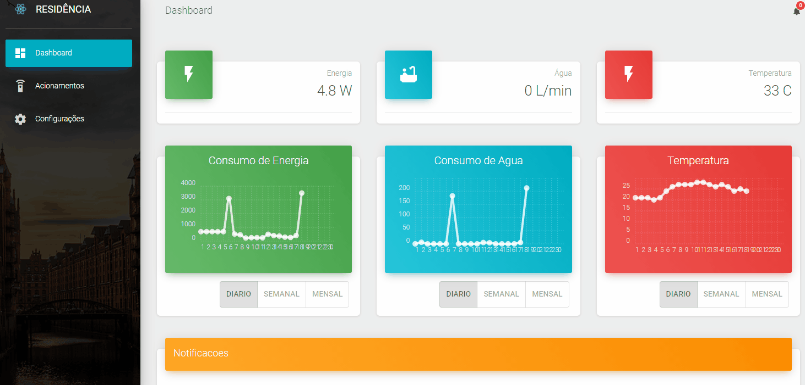
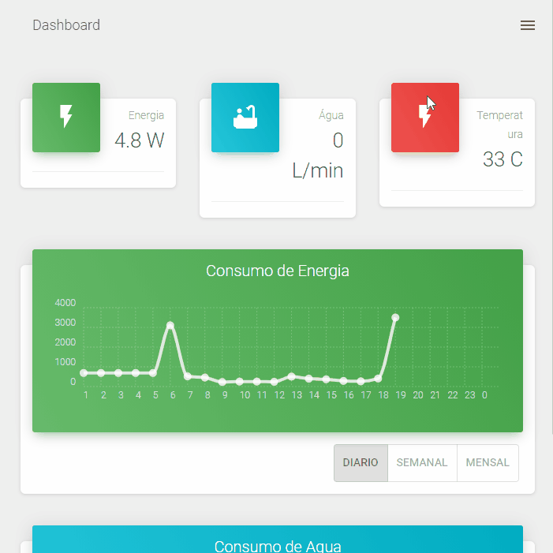
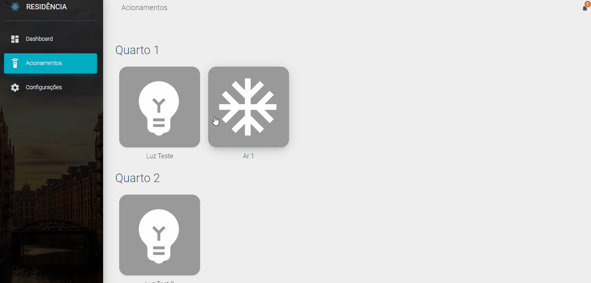
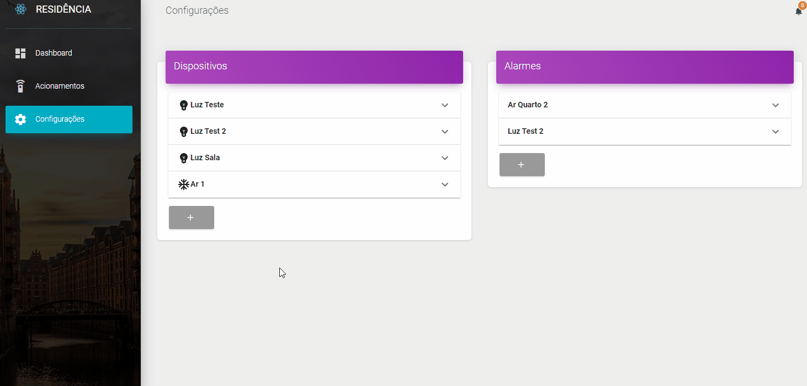
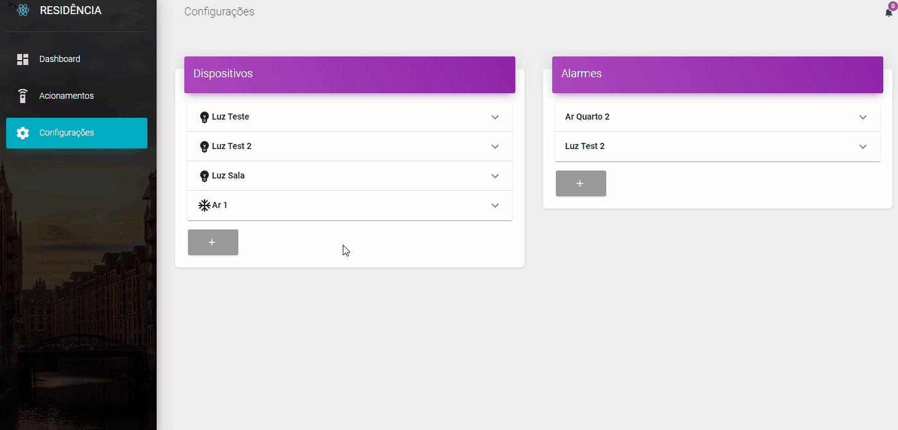
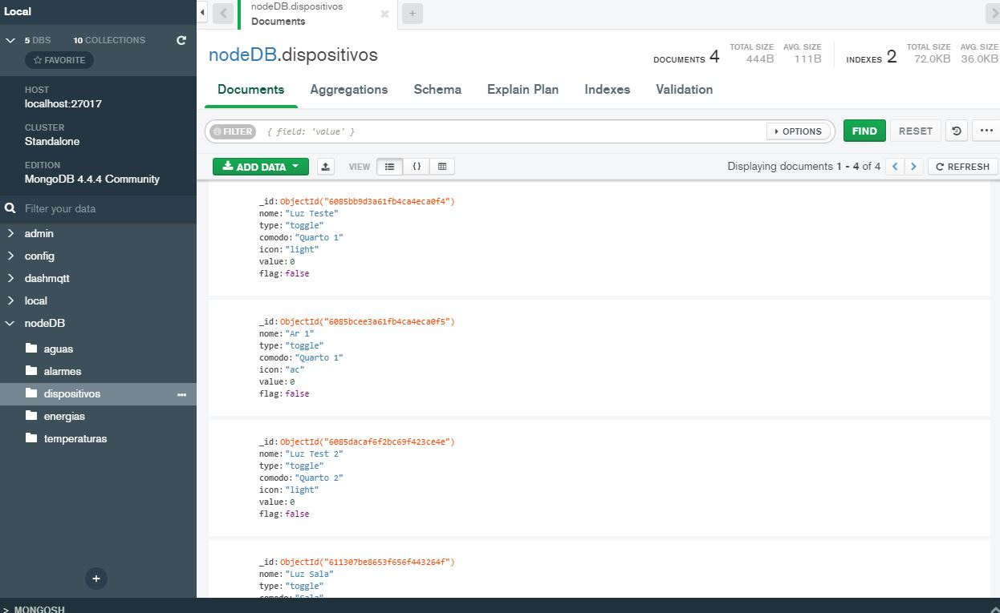

# HomeBoard (dashmqtt-front)

A home-automation dashboard I built in 2021: live sensor readings, on/off control of devices grouped by room, and automation alarms, backed by an MQTT and MongoDB service.

> **Credit:** this project is built on top of [Material Dashboard React](https://github.com/creativetimofficial/material-dashboard-react) v1.9.0 by [Creative Tim](https://www.creative-tim.com/), released under the MIT license. The application shell (sidebar, navbar, cards, grid, styling) comes from that template. The pages, components and API integration described under [What is mine](#what-is-mine-and-what-is-the-template) are my work.



## Features

- **Live sensor cards.** Power (W), water flow (L/min) and temperature are fetched from the API once per second.
- **Device control ("Acionamentos").** Devices are grouped by room; clicking a tile toggles the device on or off and the tile turns green when it is on.
- **Device and alarm management ("Configurações").** Add and delete devices (name, room, type, icon) and alarms, either at a set time of day or when a sensor crosses a threshold (greater, less or equal). The alarms themselves are evaluated by the back end every minute.
- **Responsive layout.** The template's collapsible drawer menu keeps the dashboard usable on a phone.
- The interface is in Brazilian Portuguese.

## Screenshots

Mobile screen with the drawer menu:



Turning devices on and off:



Devices and alarms in the settings page:



Adding and deleting devices and alarms:



Device documents stored in MongoDB (viewed in MongoDB Compass):



## How it works

The dashboard is a React single-page app. It does not speak MQTT itself: it talks to the REST API of [dashmqtt-back](https://github.com/erickkarl/dashmqtt-back), a Node.js service that subscribes to the sensors' MQTT topics and stores readings, devices and alarms in MongoDB.

```
sensors -> MQTT broker -> dashmqtt-back (Node/Express) <-> MongoDB
                                  ^
                                  | REST, http://localhost:5000/auth/*
                          dashmqtt-front (this repo)
```

## What is mine and what is the template

Files that differ from the Material Dashboard React 1.9.0 release (compared file by file against the upstream tag):

| Area | Change |
| --- | --- |
| `src/views/Dashboard/Dashboard.js` | Rewritten: live sensor cards, three chart cards with a daily/weekly/monthly toggle, notifications panel |
| `src/views/TableList/TableList.js` | Rewritten as the device-control page ("Acionamentos") |
| `src/views/UserProfile/UserProfile.js` | Rewritten as the device and alarm management page ("Configurações") |
| `src/components/updateEnergia.js`, `updateAgua.js`, `updateTemperatura.js` | New: components that poll the API once per second |
| `src/routes.js` | Reduced to three pages (Dashboard, Acionamentos, Configurações) with Portuguese names and icons |
| `src/layouts/Admin.js`, `src/index.js` | Sidebar title changed to "Residência", the template's color picker disabled, RTL route removed |
| `src/components/Navbars/AdminNavbarLinks.js` | Stripped down to a notifications bell |
| `package.json` | Added `axios`, `qs` and `@material-ui/lab` |
| `src/assets/github/` | Screenshots and GIFs for this README |

Everything else under `src/` (cards, grid, table, tabs, sidebar, footer, JSS styles, images) is unmodified template code. The template's demo pages (Icons, Maps, Notifications, Typography, Upgrade to Pro) are still in `src/views/` but are no longer linked from the sidebar.

## Tech stack

- React 16.13 with React Router 5, created from Create React App (`react-scripts` 3.4.1)
- Material-UI v4 (`@material-ui/core`, `icons`, `lab`)
- Chartist and `react-chartist` for the charts
- Axios for the API calls
- Node.js, Express, MQTT.js and MongoDB on the [back end](https://github.com/erickkarl/dashmqtt-back)

## Running it locally

You need the [back end](https://github.com/erickkarl/dashmqtt-back) running on `localhost:5000` (it needs MongoDB); without it the app still loads, but the sensor cards show placeholder values and the device and alarm pages stay empty.

```bash
git clone https://github.com/erickkarl/dashmqtt-front.git
cd dashmqtt-front
yarn install          # the repo is locked with yarn.lock
yarn start            # dev server, http://localhost:3000
```

Other scripts from `package.json`: `yarn build` (production bundle in `build/`), `yarn lint:check` and `yarn lint:fix`.

Notes:

- This is a 2021 toolchain (webpack 4). On Node.js 17 or newer it fails with `ERR_OSSL_EVP_UNSUPPORTED` unless you run `NODE_OPTIONS=--openssl-legacy-provider yarn start` (same for `yarn build`). Node 16 or older needs no flag. I checked the flag with `yarn start` and `yarn build` on Node 25.9.
- The API address `http://localhost:5000` is hard-coded in the components that call it.
- The `homepage` field in `package.json` was inherited from the template, so a production build expects to be served under `/material-dashboard-react/`.

## Status and known limitations

This is a 2021 project and is not maintained.

- The daily, weekly and monthly charts on the dashboard show hard-coded sample data. The back end stores timestamped readings but has no endpoint that returns history, so charts fed by real data are not implemented. The notifications panel is static text.
- A device can be created with type "Valores" (slider), but the control page only renders on/off tiles.
- There are no automated tests and no authentication.

Ideas I did not get to: real historic charts, slider control for multi-value devices, and cleaner responsive chart views.

## License

MIT, see [LICENSE.md](LICENSE.md). It keeps Creative Tim's original copyright notice, as the license requires for the template code this project is based on.
